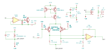

# vca-unit

WARNING: The module has not been fully tested yet!

This is a compact VCA (Voltage-Controlled Amplifier) unit that operates without any additional
external components. Its small form factor — approximately 22mm × 10.5mm — makes it ideal for
integration as a submodule in larger synthesizer projects. The module features six pins arranged
in two rows with a 2.54mm pitch, spaced seven pitches apart. It is also compatible with standard
breadboards..

The unit has been tested with a ±12V symmetrical power supply. Basic specifications are as follows:

- **Input signal range:** -8V to +8V (recommended: -5V to +5V)
- **CV range**: 0V to 8V *(unity gain is achieved at approximately 4.6V)*

Below is a simple usage of the module.

This repository includes the KiCad project files, along with the symbol and footprint for the unit.

The schematic is shown below.  Assembly does not require any trimming or calibration.

